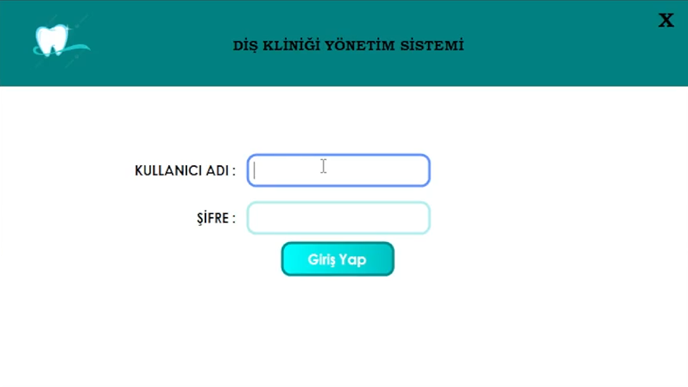
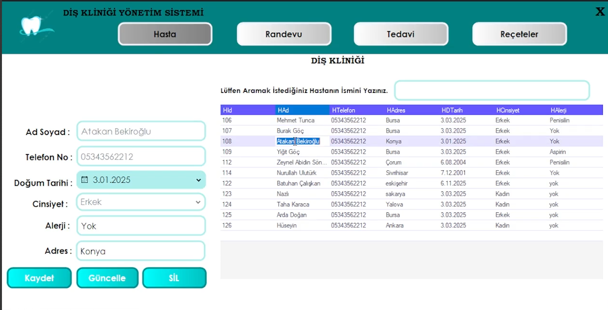
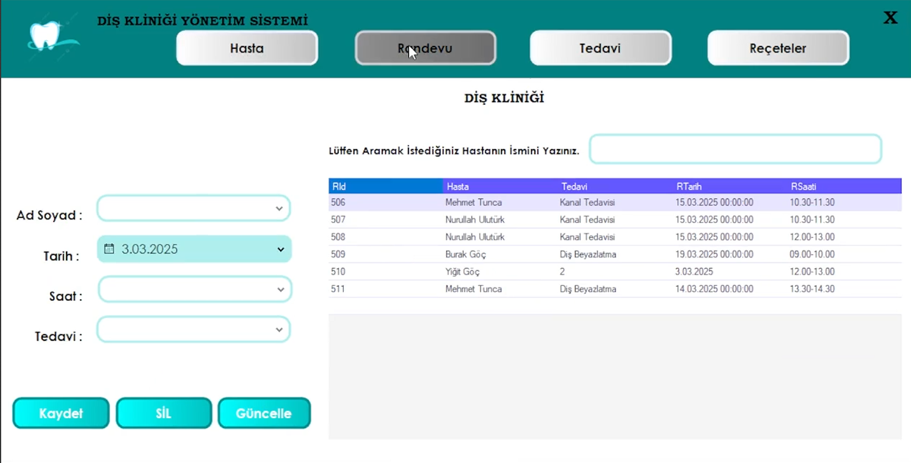
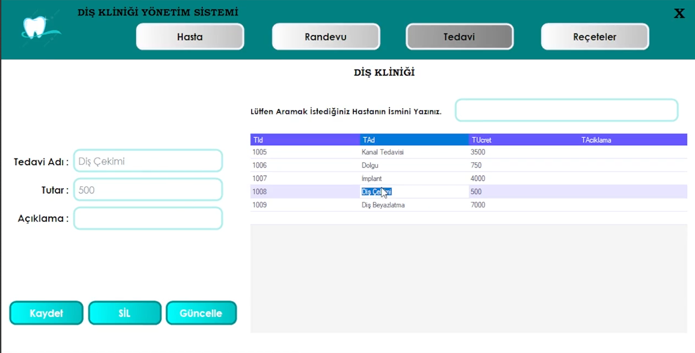
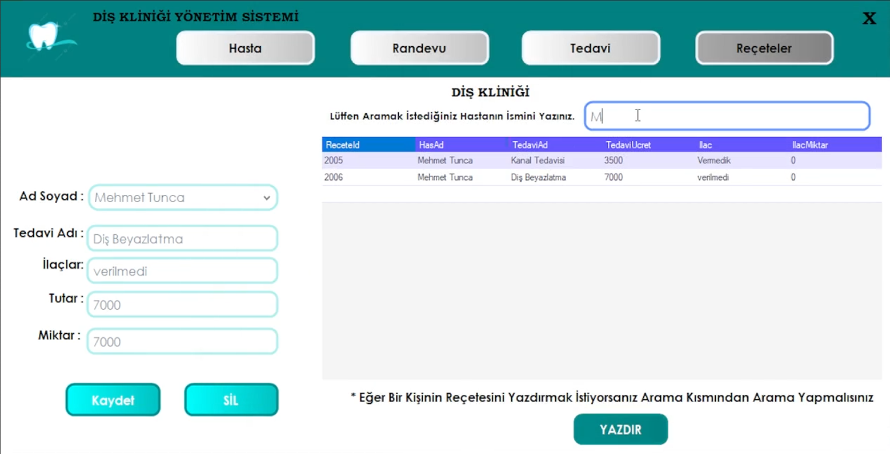

# 🏥 Diş Kliniği Yönetim Sistemi

C# Windows Forms ile geliştirdiğim **Diş Kliniği Yönetim Sistemi**, kliniklerde hasta ve randevu süreçlerini daha kolay yönetmek için tasarlanmıştır.  
Projenin tasarımında **Guna UI Framework** kullanılarak modern ve şık bir arayüz sağlanmıştır.  
Veritabanı tarafında ise **SQL Server** kullanılarak **ilişkisel veritabanı** yapısı oluşturulmuştur.

---

## 🚀 Özellikler
- 👤 Kullanıcı giriş sistemi (Login)
- 🧑‍⚕️ Hasta kayıt ve yönetimi
- 📅 Randevu oluşturma ve takibi
- 💉 Tedavi planlama ve yönetimi
- 💊 Reçete yazma ve listeleme
- 📊 Kullanıcı dostu, modern arayüz (Guna UI)
- 🗄️ SQL Server tabanlı ilişkisel veritabanı

---

## 🛠️ Kullanılan Teknolojiler
- **C# Windows Forms**
- **Guna UI Framework**
- **SQL Server**
- **ADO.NET** (Veritabanı bağlantıları için)

---

## 📷 Ekran Görüntüleri

### 🔑 Giriş Ekranı

### 🧑‍⚕️ Hasta Yönetimi

### 📅 Randevu Yönetimi

### 💉 Tedavi Yönetimi

### 💊 Reçete Yönetimi

---

## 🌐 İletişim
🔗 [Kişisel Web Sitemi Ziyaret Edin](https://esatyucel.com)  
📧 **esatyucelsoftware@gmail.com**
